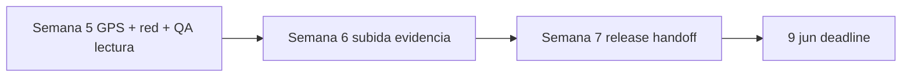

# PP2 Tigerhawk Mobile — Roadmap de entrega (deadline 9 jun 2026)

**Objetivo:** app **funcional y estable** para el rol **`driver`**, lista para uso en campo, **a más tardar el 9 de junio de 2026**.

**Jornada:** lunes–viernes, 8 h/día.

**Cierre en 3 semanas:** **Semana 5** (esta semana) → **Semana 6** → **Semana 7** (hasta **8 jun**). **9 jun** = buffer / sign-off final.

**TMS:** ya **desplegado en producción**; cambios en el repo TMS se reflejan en móvil vía `EXPO_PUBLIC_TMS_API_URL`.

**Detalle de tareas:** `PP2_TAREAS_DEV.md` · Cliente: `PROXIMOS_PASOS.md`.

---

## Calendario de cierre

| Semana dev | Semana del cierre | Ventana | Foco principal |
|------------|-------------------|---------|----------------|
| **5** | 1 | ~26–30 may | **GPS** + **desconexión/reconexión** + QA lectura docs (TMS live) |
| **6** | 2 | ~2–6 jun | **Subida evidencia** conductor (4.3, 4.8, Driver photo) |
| **7** | 3 | ~7–8 jun | **Release**, EAS build, handoff |
| — | — | **9 jun** | Deadline / margen |

---

## 1. Estado actual

### ✅ Completado (Semanas 1–4)

Auth, My Loads, detalle, field actions, ver documentos + Realtime, offline v1 base, tests upload/FormData, checklist QA 4.7, capa TMS upload (4.1 móvil + TMS live).

### ⏳ Pendiente por semana

| Semana | Entregables |
|--------|-------------|
| **5** (esta) | GPS 5.1–5.4, hardening red 5.5, QA §A–C 5.6, CI/smoke 5.7 |
| **6** | Alcance 6.1, habilitar PodUploadSection 6.2, validación 6.3, QA §D 6.4 |
| **7** | QA final, EAS APK, semver/README, handoff (**9 jun** buffer) |

### ❌ v1.1 (post–9 jun)

Push, mensajes, wait time, E2E automatizado, GPS background/mapa.

---

## 2. Gap TMS vs móvil

| Capacidad | Móvil | Semana |
|-----------|-------|--------|
| Lista/detalle + status | ✅ | — |
| Ver documentos | ✅ | QA **5.6** |
| GPS primer plano | Pendiente | **5** |
| Reconexión estable | Base ✅ | **5.5** |
| Subir POD/Photo | UI ❌ | **6** |
| Mensajes / push / wait time | No | v1.1 |

---

## 3. Dependencias

| Riesgo | Mitigación |
|--------|------------|
| GPS permisos denegados en campo | UX clara + fallback “Share location” manual |
| Regresión Wi‑Fi | Prioridad **5.5** esta semana |
| Subida no lista sem 6 | v1 con lectura + status + GPS; upload en patch post-9 jun |

---

## 4. Definition of Done (9 jun)

1. Login → My Loads → detalle → **Field actions**.
2. Ver documentos TMS (**View**, Realtime / pull).
3. **GPS** en primer plano (posición o compartir).
4. Red intermitente sin crash ni spinner colgado.
5. **Subir evidencia** POD/Photo → visible en TMS Documents (**Semana 6**).
6. Build Android entregable + handoff.

---

## 5. Referencias

- `PP2_TAREAS_DEV.md`, `PROXIMOS_PASOS.md`
- `docs/QA_DRIVER_DOCUMENTS_4_7.md`, `docs/QA_DRIVER_ACTIONS_3_7.md`
- `docs/OFFLINE_V1.md`, `docs/MOBILE_BUILDS.md`

---

*Actualizar al cerrar cada semana de cierre.*
