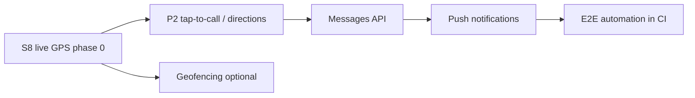

# Backlog v1.1 — Tigerhawk Mobile (task 7.7)

Prioritized **post–v0.1.0** work after the **9 Jun 2026** driver MVP.  
v0.1.0 scope is frozen in `docs/MVP_SCOPE.md` and `docs/RELEASE_NOTES_0_1_0.md`.

**Audit source:** `docs/DRIVER_TMS_CAPABILITIES_5_7.md` (TMS vs mobile, May 2026).  
**Support for v0.1.0:** `docs/MOBILE_SUPPORT_RUNBOOK_7_6.md`.

---

## Priority legend

| Label | Meaning |
|-------|---------|
| **P2** | Small win; no new backend contract |
| **v1.1** | Next mobile release slice |
| **S8** | **Semana 8** (`PP2_TAREAS_DEV.md` **8.2–8.17**) — **#1 priority**; phase 0 = active trip + foreground 30–60 s, no external tracking API |

---

## Backlog table

| Priority | Feature | Mobile / TMS | Effort | Depends on | Notes |
|----------|---------|--------------|--------|------------|-------|
| **S8** | **Live GPS + TMS map** (persist location, Realtime marker) | Both | Large | **8.2** status list; **8.4–8.6** Supabase | **Driver:** mobile app only (foreground). **TMS UI:** edit `docs/TMS_DEV_REPOSITORY.md` path — extend `LoadSidebarMap` (**8.12**); map today is stops-only, not live. No external tracking API. |
| **v1.1** | **Expo push** (assignment, status change) | Mobile + TMS events | Medium | TMS notification hooks or Supabase triggers | Out of v0.1.0 (`DRIVER_TMS_CAPABILITIES` §v1.1) |
| **v1.1** | **Load messages** (replace placeholder card) | Both | Medium | `GET/POST …/loads/[id]/messages` driver channel + RLS | UI today: `LoadDetailContent` shows `noMessages` only; `mocks/messages.ts` unused in production path |
| **v1.1** | **Wait time** capture / display | TMS API exists | Medium | Product rules for driver-entered wait | Not in v0.1.0 parity matrix |
| **v1.1** | **Geofencing** (pickup/delivery arrival hints) | Mobile + rules | Large | Live GPS (**S8**) or manual check-in policy | Often paired with background location — legal copy required |
| **v1.1** | **E2E automated** (Maestro / Detox) | CI | Medium | Stable test driver + staging TMS | Complements manual `docs/QA_DRIVER_UPLOAD_E2E_6_4.md` |
| **P2** | **Tap-to-call** customer | Mobile only | Small | Phone on load row | `Linking.openURL('tel:…')` |
| **P2** | **Directions** to pickup/delivery | Mobile | Small | Address fields on `loads` | Maps deep link (not only current GPS share) |
| **P2** | **HOT filter** / sort by appointment | Mobile | Small | Data already on list | |
| **v1.1** | **Driver itinerary** (day view) | TMS feature | Medium | API or Supabase view | Optional “today” filter on **My Loads** as interim |
| **v1.1** | **Offline-first** (queue uploads/actions) | Mobile | Large | Conflict resolution with TMS | v0.1.0 has banner + reconnect refetch (`docs/OFFLINE_V1.md`) |
| **v1.1** | **Dynamic field-action rules** from TMS | Both | Large | Admin transitions API exposed to mobile | v0.1.0 uses `lib/loads/driver-actions.ts` |
| **Deferred** | Background GPS all day | Mobile | Large | Out of phase 0 (**8.10**) | Battery + Play/App Store policy |
| **Excluded** | BOL/RC upload by driver, dispatch menus, pay/settlements | — | — | — | Driver type **Driver** only (Semana 6) |

---

## Semana 8 — live tracking (not duplicated here)

All tasks **8.2–8.17** live in `PP2_TAREAS_DEV.md` § Semana 8:

1. **8.2** — Active load statuses + map surface.
2. **8.3** ✅ — Architecture `GPS_LIVE_TRACKING_ARCHITECTURE.md`.
3. **8.4–8.6** — Supabase schema, RLS, Realtime.
4. **8.7–8.9** — Mobile sender; **8.12–8.13** — TMS map.

**v1 GPS delivered in v0.1.0:** foreground **Share location** only — `docs/GPS_V1_DECISION.md`, `docs/GPS_TMS_INTEGRATION_5_3.md`.

---

## Suggested release order (v1.1)

1. **S8 live GPS (phase 0)** — Supabase + TMS map + mobile foreground 30–60 s (**no third-party tracking API**).  
2. **Quick wins (P2)** — tap-to-call, directions.  
3. **Messages + push** — dispatcher ↔ driver comms.  
4. **Geofencing + offline-first + background (8.10)** — deferred post phase 0.

---

## Open P0/P1 from v0.1.0 (not backlog — must close on production)

| ID | Item | Proof |
|----|------|-------|
| **P0** | TMS Bearer on status + documents | `docs/QA_RELEASE_SIGNOFF_7_1.md` §P0 |
| **P1** | Driver photo upload sign-off | `docs/QA_DRIVER_UPLOAD_E2E_6_4.md` §D |

---

## Code anchors (v0.1.0)

| Area | Path |
|------|------|
| Routes | `app/(auth)/login`, `app/(drawer)/loads`, `app/(drawer)/account`, `app/load/[id]` |
| Upload | `hooks/useLoadDocumentUpload.ts`, `lib/tms/upload-driver-load-document.ts` |
| Status | `lib/loads/driver-actions.ts`, `lib/tms/patch-load-status.ts` |
| GPS share | `components/loads/LoadLocationSection.tsx` |
| Route guards | `lib/qa/__tests__/app-routes-smoke.test.ts`, `load-detail-routes.test.ts` |

---

**Related:** `PP2_TAREAS_DEV.md` (Semana 8), `docs/GPS_LIVE_TRACKING_ARCHITECTURE.md`, `docs/TMS_DEV_REPOSITORY.md`, `docs/MOBILE_SUPPORT_RUNBOOK_7_6.md`, `CHANGELOG.md` (Unreleased section when v1.1 starts).
