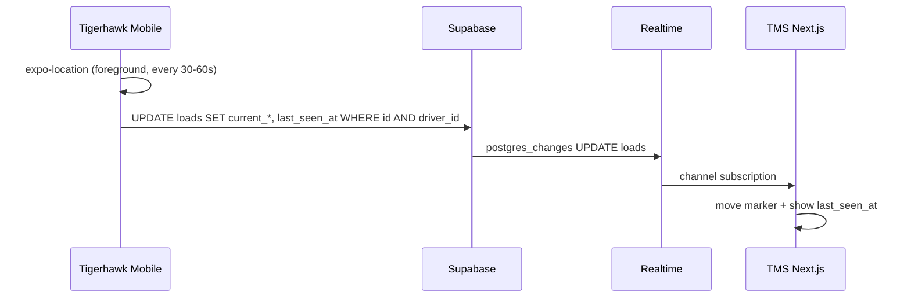

# Live driver tracking — architecture (Semana 8 / task 8.3)

**Status:** draft for **MVP phase 0** (foreground only)  
**Product:** Tigerhawk Mobile + TigerHawk TMS (same Supabase project)  
**Explicit:** **no third-party tracking API** (no Samsara, Fleetio, Mapbox **Tracking**, Google Fleet Engine, etc.)

---

## What we are building (phase 0)

| Requirement | Choice |
|-------------|--------|
| Driver grants location | **Option 1 (required):** **Tigerhawk Mobile** open on load detail, foreground GPS. **Not** phase 0: TMS browser link / web geolocation |
| Update interval | **30–60 s** while tracking is active (config in `tracking-policy.ts`, task 8.7) |
| TMS shows | **Last** `{ lat, lng }` + **`last_seen_at`** on map marker |
| Refresh on map | Supabase **Realtime** `postgres_changes` on `UPDATE` (same pattern as loads/documents) |
| Background / phone locked | **Out of scope** phase 0 → task **8.10 N/A** |
| Route history / playback | **Out of scope** phase 0 → task **8.14 deferred** |
| Production retention / legal | Minimal; task **8.15** later |

This matches **model B** in `PP2_TAREAS_DEV.md`: `current_latitude`, `current_longitude`, `last_seen_at` on **`loads`** (recommended: one marker per active load in dispatcher view).

---

## No external tracking API required

| Layer | Technology | Notes |
|-------|------------|--------|
| GPS on device | **Expo Location** (`expo-location`, already in project) | Foreground `whenInUse` — extends `docs/GPS_V1_DECISION.md` |
| Transport | **Supabase** client (`UPDATE` with RLS) | Preferred phase 0; optional TMS `PATCH` later (task 8.11) |
| Live UI | **Supabase Realtime** | Add table/columns to `supabase_realtime` publication |
| Map tiles | **Leaflet + OpenStreetMap** | TMS dev repo: `LoadSidebarMap` today = pickup/delivery only — **not live driver** until **8.12** (see `docs/TMS_DEV_REPOSITORY.md`) |
| Routing / ETA API | **Not needed** for “where is the driver now” | Optional later for directions |

**Not required:** Mapbox/Google **paid tracking** SKUs, webhooks to telematics vendors, or a separate GPS microservice.

---

## Data flow

**Stop sending when:** app backgrounded/closed, user denies permission, load leaves “active trip” statuses (task 8.2), or driver logs out.

---

## Schema (phase 0 — task 8.4)

On table **`loads`** (per-load marker for dispatch):

| Column | Type |
|--------|------|
| `current_latitude` | `double precision` NULL |
| `current_longitude` | `double precision` NULL |
| `last_seen_at` | `timestamptz` NULL |
| `location_accuracy_m` | `double precision` NULL (optional) |

**Apply in Supabase SQL Editor (additive — safe for prod TMS):**

1. `supabase/sql-editor/20260605120000_pp2_driver_live_location_loads.sql` — **8.4 + 8.5** (columns, RLS, trigger guard).
2. `supabase/sql-editor/VERIFY_pp2_driver_live_location.sql` — smoke.
3. `supabase/sql-editor/enable_realtime_driver_tracking.sql` — **8.6** if `loads` not yet in Realtime.
4. Optional (if 8.5 applied before 22 Jun 2026): `fix_pp2_driver_location_trigger_updated_at.sql` — exclude auto `updated_at` from driver guard.

**Status:** **Applied 22 Jun 2026** on shared Supabase (prod TMS + mobile). Mobile send + TMS map UI still pending **8.7–8.13**.

**RLS (8.5):** new policy `Drivers update live location on assigned loads` only — **does not** replace Staff policies. Trigger `pp2_enforce_driver_location_update` blocks drivers from changing `status` or other fields.

**Realtime (8.6):** `loads` UPDATE fires events when `current_*` changes (usually already published).

---

## Mobile (tasks 8.7–8.9)

| Piece | Path / action |
|-------|----------------|
| Policy | `lib/location/tracking-policy.ts` — interval 30–60 s, active statuses, distance threshold optional | ✅ **8.7** |
| Sender | `useDriverLocationTracking(loadId)` — start on load detail focus, stop on blur/unmount | ✅ **8.8** |
| UI | Banner on load detail: “Sharing location with dispatch” + `last_sent_at` | ✅ **8.9** |
| Existing share | Keep **Share location** WhatsApp/manual (`LoadLocationSection`) — complementary |

Replaces need to call stub `postDriverLocationToTms()` if using **Supabase-only** path (flip `canPersistLocationToTms` only when TMS route 8.11 is added).

---

## TMS (tasks 8.12–8.13)

| Piece | Action |
|-------|--------|
| Load detail map | Extend map component: second marker at `current_latitude/longitude`, tooltip `last_seen_at` | ✅ **8.12** |
| Dispatcher board | Optional list column “Last seen” or mini-map; click → load detail | ✅ **8.13** |
| Fetch | `cache: 'no-store'` or Realtime-only patch state — avoid stale marker |

Implement in **TMS development repository** only:

`C:\Users\ariel\OneDrive\Escritorio\RECRUITING_SMARTER___BRASIL\TMS_fusion`

Do **not** edit `PROYECTO_MUESTRA/`. See `docs/TMS_DEV_REPOSITORY.md`.

---

## Product scope (phase 0 — fixed)

- Tracking **only** when load is in **active trip** statuses (list in task **8.2**, e.g. _In Transit_, _At Pickup_, _At Delivery_, …).
- **Foreground only** — Tigerhawk Mobile open on load detail; no full workday / background (**8.10** N/A).
- No written client sign-off required for this scope.

---

## Minimum task checklist (phase 0)

| Task | Required for phase 0? |
|------|------------------------|
| 8.2 | **Yes** — status list + map surface (load detail vs board) |
| 8.3 | **Yes** — this document |
| 8.4–8.6 | **Yes** — schema, RLS, Realtime |
| 8.7–8.9 | **Yes** — mobile policy, hook, UI |
| 8.10 | **No** — N/A |
| 8.11 | **Optional** — Supabase direct is enough |
| 8.12–8.13 | **Yes** — TMS map + dispatcher visibility |
| 8.14–8.15 | **No** — later |
| QA checklist | `docs/QA_DRIVER_LIVE_TRACKING.md` — marker in TMS ≤ 60 s | ✅ **8.16** |
| 8.17 | **Yes** — daily reports when shipped |

---

## Related docs

- `docs/GPS_V1_DECISION.md` — v0.1.0 foreground share only  
- `docs/GPS_TMS_INTEGRATION_5_3.md` — v1 had no persist API (superseded for live tracking by Supabase columns)  
- `docs/BACKLOG_V1_1_7_7.md` — v1.1 priority  
- `PP2_TAREAS_DEV.md` § Semana 8
