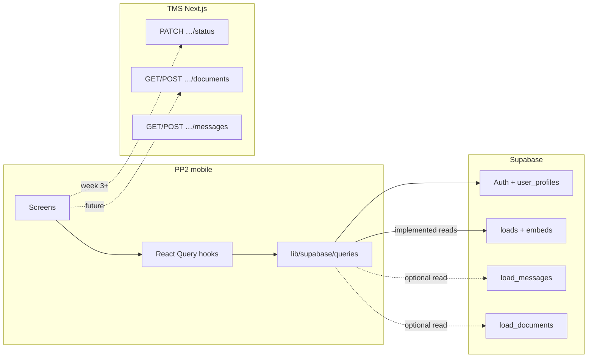

# TMS ↔ PP2 mobile — API audit (dev task 1.5)

**Date:** 18 May 2026  
**Scope:** read-only review of TigerHawk TMS code under `PROYECTO_MUESTRA/` (do not edit).  
**Goal:** define what the mobile app reads from **Supabase** vs what it must call on the **TMS Next.js API**, and record gaps for status changes and POD.

**Related:** `docs/RLS_MOBILE_REVIEW.md` (1.3), `docs/LOADS_DATA_MAP.md` (2.1), `docs/DISPATCHER_API_ROUTES.md` (2.3), `docs/QUERY_CACHE.md` (2.4), `docs/SUPABASE_LAYER.md` (1.7), `docs/SECRETS_AND_BFF.md` (1.8).  
**Task 2.8 (19 May 2026):** §4 documents **what is implemented today** (Supabase reads) vs **what will use TMS `app/api/`** (writes and future features).

---

## 1. Sources reviewed

| Artifact | Path (TMS, read-only) | Role |
|----------|------------------------|------|
| Driver action UI | `components/dispatcher/DriverActionPanel.tsx` | Reference for **which statuses** a driver may trigger in the field |
| Status API | `app/api/dispatcher/loads/[id]/status/route.ts` | **PATCH** `{ status }` — auth, transitions, holds, side effects |
| Documents API | `app/api/dispatcher/loads/[id]/documents/route.ts` | **GET** list + signed URLs; **POST** upload (staff only today) |
| Transition defaults | `types/dispatcher.ts` → `VALID_LOAD_TRANSITIONS` | Fallback map when `/api/admin/transitions` is unavailable |
| Messages API | `app/api/dispatcher/loads/[id]/messages/route.ts` | GET/POST messages (no explicit driver/staff split in route) |

---

## 2. `DriverActionPanel.tsx` — behaviour

### 2.1 Purpose

Web-side **simulator** for driver field actions during dispatch QA. It is not the production driver app; PP2 mobile should mirror only the **Driver** subset of buttons.

### 2.2 Transition source

1. On mount, `GET /api/admin/transitions` → `data.transitions` (DB overrides).
2. On failure, falls back to `VALID_LOAD_TRANSITIONS` from `types/dispatcher.ts`.

Mobile should use the **same effective map** in task 3.1 (fetch transitions from TMS or replicate server rules), not only the static subset in `lib/loads/constants.ts`.

### 2.3 Status grouping (UI only)

| Group | Statuses (hardcoded `DRIVER_STATUSES` / `FINAL_STATUSES`) | Show on PP2? |
|-------|-----------------------------------------------------------|--------------|
| **Driver** | `Arrived At Pickup`, `In Transit`, `Arrived At Delivery`, `Delivered`, `At Warehouse`, `Arrived To Hook Container`, `Enroute To Drop Container`, `Dropped - Loaded`, `Dropped - Empty`, `Enroute To Return Empty`, `Arrived At Return Empty` | **Yes** — only these as action buttons |
| **Dispatcher** | Any valid next state not in Driver or Final (e.g. `Assigned`, `Dispatched` from some states) | **No** |
| **Final** | `Completed`, `Cancelled` | **No** in v1 unless product explicitly allows driver to complete/cancel (API currently does not restrict driver to Driver-only transitions — see §3.4) |

PP2 already mirrors the Driver set in `lib/loads/constants.ts` → `DRIVER_FIELD_STATUSES` (aligned with TMS panel).

### 2.4 API call from panel

```http
PATCH /api/dispatcher/loads/{loadId}/status
Content-Type: application/json

{ "status": "<LoadStatus>" }
```

- Session: Supabase cookie on web; mobile must send **`Authorization: Bearer <access_token>`** (same JWT as Supabase Auth).
- Errors surfaced in UI:
  - `data.error` (generic)
  - `data.code === "ACTIVE_HOLDS"` + `data.activeHolds[]`
  - `validNextStates` on invalid transition (400)

### 2.5 Holds in UI

Buttons disabled when `activeHolds.length > 0` and role ≠ `admin` (client-side). Server enforces the same for non-admin (§3.3).

---

## 3. `status/route.ts` — PATCH contract

### 3.1 Authentication & authorization

| Check | Rule |
|-------|------|
| Auth | `supabase.auth.getUser()` — **401** if missing |
| Staff | `user_profiles.role` ∈ `admin`, `dispatcher` → may update any load (subject to holds) |
| Driver | `role === "driver"` **and** `loads.driver_id === user.id` → may update **assigned** load only |
| Else | **403** `"You don't have permission to update this load status"` |

### 3.2 Request / validation

- Body: `{ "status": "<LoadStatus>" }` validated with `statusChangeSchema`.
- Transition: `getEffectiveTransitions()` then `newStatus` must be in `transitionMap[currentStatus]`.
- Invalid transition → **400** with `validNextStates`.

### 3.3 Holds

- `getActiveHoldKeys(load)` on hold columns (`freight_hold`, `customs_hold`, etc.).
- If any active hold and `profile.role !== "admin"` → **403**:
  - `code: "ACTIVE_HOLDS"`
  - `activeHolds: string[]`
  - `error`: human-readable message

Mobile: map this in UX (task 3.4); client preview via `lib/loads/active-holds.ts`.

### 3.4 Driver vs transition map (security gap)

The route validates **role + assignment + transition map** but does **not** filter `newStatus` to the Driver subset. A driver who knows a dispatcher-only target status could send it if the transition map allows it from the current state.

**Recommendation (task 3.3):** when `profile.role === "driver"`, reject statuses outside `DRIVER_FIELD_STATUSES` (and optionally allow `Completed` only if business approves).

### 3.5 Side effects (server-only)

Non-exhaustive; mobile must not duplicate:

- Timestamps: `actual_pickup`, `actual_delivery`, `completed_date` by target status.
- Driver row: on `Completed`, `drivers.status` → `Available`.
- Auto driver pay / A/P records, emails, activity log (admin client).
- **In Transit** requires `driver_id` set — **400** otherwise.

### 3.6 Database update path

- Updates `loads` via Supabase server client (RLS: staff UPDATE policy; driver has **no** direct UPDATE policy — update runs with user JWT; staff policies apply).
- Driver updates succeed because the **API route** uses the authenticated user; RLS on `loads` for UPDATE is staff-only — **the route relies on service role or staff RLS for the update path**. In practice the server `createClient()` uses the user's session; verify in staging that driver PATCH succeeds (TMS already uses this pattern in production panel).

> **Note:** If driver PATCH fails with RLS in some environments, the fix belongs in the TMS (policy or service role inside route), not in mobile direct UPDATE.

---

## 4. Data access matrix — Supabase vs TMS (task 2.8)

### 4.0 Design rule

| Layer | Use when | Client credential |
|-------|----------|-------------------|
| **Supabase PostgREST** | Read assigned loads, profile, (future) messages/documents rows | `EXPO_PUBLIC_SUPABASE_ANON_KEY` + user JWT (RLS) |
| **TMS Next.js `app/api/`** | Status changes, signed document URLs, staff-only flows | Same JWT as `Authorization: Bearer` (see `docs/SECRETS_AND_BFF.md`) |
| **Neither** | Pay, billing, dispatch assignment, admin | Out of mobile v1 scope |

The mobile app **does not** use `SUPABASE_SERVICE_ROLE_KEY` or direct `UPDATE` on `loads` for status (driver RLS is SELECT-only on `loads`).



### 4.1 Supabase — implemented (reads)

All queries live in `lib/supabase/queries/`, called from hooks with React Query (`docs/QUERY_CACHE.md`). Every loads query also applies `.eq('driver_id', user.id)` in addition to RLS.

| Capability | Table / object | Query function | Hook / UI | Select / notes |
|------------|----------------|----------------|-----------|----------------|
| Login / session | `auth.users` (via SDK) | — | `AuthContext`, `useAuth` | SecureStore; magic link + password |
| Profile | `user_profiles` | `fetchUserProfile` | `useProfile` → Account, gates loads | `id, role, full_name, email` |
| Loads list (paginated) | `loads` + `containers`, `customers` | `fetchDriverLoadsPage` | `useAssignedLoadsQuery` → `/(drawer)/loads` | `LOAD_LIST_SELECT`; page size 20 |
| Load detail | same + `drivers` embed | `fetchLoadDetailForDriver` | `useLoadDetailQuery` → `/load/[id]` | `LOAD_DETAIL_SELECT`; mapper `mapLoadDetailRowToDetail` |
| List convenience | — | `fetchLoadsForDriver` | (first page only) | Wraps page 0 of `fetchDriverLoadsPage` |

**Column / embed map:** `docs/LOADS_DATA_MAP.md`.  
**RLS:** `docs/RLS_MOBILE_REVIEW.md` — driver reads own loads via `driver_id = auth.uid()` (requires `drivers.id` = auth UUID for assigned loads).

**Not read from Supabase in UI yet (RLS ready):**

| Capability | Table | Planned channel | UI today |
|------------|-------|-----------------|----------|
| Messages | `load_messages` | Supabase SELECT and/or TMS GET | Empty card on detail |
| Documents | `load_documents` | Supabase SELECT and/or TMS GET | POD placeholder |

### 4.2 TMS Next.js API — planned writes & server logic

**Base URL:** `env.tmsApiUrl` from `EXPO_PUBLIC_TMS_API_URL` or `NEXT_PUBLIC_APP_URL` (`.env.example`, `lib/config/env.ts`). Trailing slash stripped.

**Status PATCH wired (task 3.1):** `lib/tms/patch-load-status.ts` → `PATCH {tmsApiUrl}/api/dispatcher/loads/[id]/status`.

**POD POST (task 4.1):** `lib/tms/upload-load-document.ts` → `POST {tmsApiUrl}/api/dispatcher/loads/[id]/documents` after TMS patch in `docs/TMS_PATCH_4_1_DRIVER_DOCUMENTS.md` (option **A**). UI wiring in task 4.2.

| Capability | Method | TMS route | PP2 when | Why TMS (not Supabase client) |
|------------|--------|-----------|----------|-------------------------------|
| Status change | `PATCH` | `/api/dispatcher/loads/[id]/status` | **Done (3.1)** | `lib/tms/patch-load-status.ts`; `app/load/[id].tsx` |
| Messages list | `GET` | `/api/dispatcher/loads/[id]/messages` | Future | Optional if not using direct SELECT |
| Send message | `POST` | `/api/dispatcher/loads/[id]/messages` | Future | Assignment checks on server |
| Documents list | `GET` | `/api/dispatcher/loads/[id]/documents` | Future | Signed URLs via admin client (§5.1) |
| POD upload | `POST` | `/api/dispatcher/loads/[id]/documents` | **Ready (4.1)** | TMS patch **A** documented; mobile client in `lib/tms/upload-load-document.ts` |
| Load list / detail (staff) | `GET` | `/api/dispatcher/loads`, `…/loads/[id]` | **Not used** | Mobile uses Supabase equivalents |

Route reference: `docs/DISPATCHER_API_ROUTES.md` (subset of `PROYECTO_MUESTRA/docs/DISPATCHER_API_ROUTES.md`).

**Auth header (to implement in 3.1):**

```ts
import { env } from '@/lib/config/env';

const session = /* from useAuth / getSupabase().auth.getSession() */;

await fetch(`${env.tmsApiUrl}/api/dispatcher/loads/${loadId}/status`, {
  method: 'PATCH',
  headers: {
    Authorization: `Bearer ${session.access_token}`,
    'Content-Type': 'application/json',
  },
  body: JSON.stringify({ status: nextStatus }),
});
```

If `env.tmsApiUrl` is empty, status calls must fail fast with a clear config error (document in ops runbook).

### 4.3 Client-only behaviour (not persisted to TMS/DB)

| Behaviour | Where | Notes |
|-----------|-------|-------|
| Driver status buttons | `DriverActionBar` → `useDriverStatusChange` → `runDriverStatusChange` | Optimistic cache only when safe; rollback on error; invalidate on success; dev telemetry |
| Pull-to-refresh | `useAssignedLoadsQuery` / `useLoadDetailQuery` | Refetch from Supabase; overwrites local status demo |
| Mock auth | `EXPO_PUBLIC_ENABLE_MOCK_AUTH=1` | Dev only; off by default |

### 4.4 Quick reference — one glance

| Data | Source now | Source target |
|------|------------|---------------|
| Who am I? | Supabase `user_profiles` | Same |
| My loads list | Supabase `loads` | Same |
| Load detail | Supabase `loads` + embeds | Same |
| Change status | TMS `PATCH …/status` | Same (3.1) |
| POD / photos | — | TMS POST (after backend allows driver) or Storage+BFF |
| Chat | — | Supabase and/or TMS messages API |

---

## 5. `documents/route.ts` — GET / POST

### 5.1 GET `/api/dispatcher/loads/{id}/documents`

| Step | Behaviour |
|------|-----------|
| Auth | Required — **401** if no user |
| Load check | `loads` row must exist — **404** |
| Data | `load_documents` for `load_id`, ordered by `uploaded_at` desc |
| URLs | Admin client refreshes **signed URLs** (1h) for `storage_path` in bucket `load-documents` |

Mobile may use **Supabase SELECT** on `load_documents` (RLS: driver scoped to assigned loads) instead of TMS GET, unless signed URLs are required — then prefer TMS GET or Storage signed URL from a thin BFF.

### 5.2 POST `/api/dispatcher/loads/{id}/documents`

| Check | Rule |
|-------|------|
| Auth | Required |
| Role (today in TMS) | **`admin` or `dispatcher` only** — **403** for `driver` until patch applied |
| Role (after patch 4.1) | Staff **or** assigned `driver` (`loads.driver_id === user.id`); drivers limited to **`POD`** / **`Photo`** |
| Body | `multipart/form-data`: `file`, optional `document_type` (enum via `documentTypeSchema`) |
| Size | Max **50 MB** (`52428800` bytes) — mirrored in `lib/tms/document-upload-limits.ts` |
| Filename | Max **255** chars; storage path `{loadId}/{timestamp}_{sanitizedName}` |
| Storage | Admin client upload to `load-documents`, then insert `load_documents` row |

**Task 4.1 decision:** option **(A)** — extend this POST (see `docs/TMS_PATCH_4_1_DRIVER_DOCUMENTS.md`). PP2 mobile: `uploadLoadDocument`, `assertDriverUploadDocumentType`, client validation before upload. **Deploy TMS patch** before end-to-end POD in the app (task 4.2).

---

## 6. Critical model: `loads.driver_id`

| Layer | Expectation |
|-------|-------------|
| **FK (Postgres)** | `loads.driver_id` → `drivers.id` |
| **RLS (mobile)** | `driver_id = auth.uid()` on SELECT |
| **Status API** | `currentLoad.driver_id === user.id` for assigned driver |
| **TMS assign-driver** | Sets `driver_id` to **`drivers.id`** from dispatcher UI |

For drivers with login, the TMS pattern for mobile is:

1. Auth user UUID = `user_profiles.id`.
2. Row in `drivers` with **`drivers.id` = that same UUID** (see `npm run db:seed-driver-test`).
3. Loads assigned with `driver_id` = that UUID.

Legacy drivers without auth may have `drivers.id` ≠ any `auth.users.id`; those loads are visible in TMS but **not** via PP2 until linked.

---

## 7. Error catalogue (mobile handling)

| HTTP | Condition | Response hints | PP2 action |
|------|-----------|----------------|------------|
| 401 | No session | `{ error: "Unauthorized" }` | Redirect to login |
| 403 | Not assigned / role | permission message | Show banner |
| 403 | Holds | `code: "ACTIVE_HOLDS"`, `activeHolds` | Disable actions; show hold keys |
| 400 | Invalid transition | `validNextStates` | Refresh allowed actions |
| 400 | In Transit without driver | plain error | Hide action (should not happen for driver) |
| 404 | Unknown load | — | Back to list |
| 500 | Server/DB | — | Retry + `safeLog` (no tokens) |

---

## 8. PP2 implementation checklist (from audit)

| # | Item | Dev task |
|---|------|----------|
| 1 | Wire `PATCH {tmsApiUrl}/api/dispatcher/loads/[id]/status` with session JWT | 3.1 |
| 2 | Fetch effective transitions from TMS (or cache) instead of only `MOCK_LOAD_TRANSITIONS` | 3.1 |
| 3 | UI: only `DRIVER_FIELD_STATUSES` (+ optional `Completed` if approved) | 3.2 |
| 4 | Server: restrict driver role to driver transitions | 3.3 |
| 5 | Map `ACTIVE_HOLDS` and 403 UX | 3.4 |
| 6 | POD upload path after TMS/backend decision | ✅ 4.1 (patch + `lib/tms`); UI 4.2 |
| 7 | Messages: Supabase read and/or TMS POST with assignment checks | 2.x / 3.x |
| 8 | Document `EXPO_PUBLIC_TMS_API_URL` for staging/production Netlify URL | ✅ `docs/MOBILE_API.md` §4.2, `.env.example` |
| 9 | Driver GPS: Share sheet v1; TMS persist when dedicated route exists | ✅ 5.2–5.3 · `docs/GPS_TMS_INTEGRATION_5_3.md` |

---

## 10. Driver GPS / location (task 5.3)

| Topic | Finding |
|-------|---------|
| TMS tracking API | **Not deployed** — `/api/tracking/loads/[id]/locations` appears only in roadmap doc, not in `app/api/`. |
| v1 mobile | **Share location** on load detail (`LoadLocationSection`) — native sheet with load ref + coordinates. |
| Persist to TMS | **Deferred** — `canPersistLocationToTms()` is `false` in `lib/location/tms-location-integration.ts`. |
| Detail | `docs/GPS_TMS_INTEGRATION_5_3.md`, `docs/GPS_V1_DECISION.md` |

---

## 9. References (read-only)

- `PROYECTO_MUESTRA/components/dispatcher/DriverActionPanel.tsx`
- `PROYECTO_MUESTRA/app/api/dispatcher/loads/[id]/status/route.ts`
- `PROYECTO_MUESTRA/app/api/dispatcher/loads/[id]/documents/route.ts`
- `PROYECTO_MUESTRA/types/dispatcher.ts` (`VALID_LOAD_TRANSITIONS`, `LoadStatus`)
- PP2: `lib/loads/driver-actions.ts`, `lib/loads/constants.ts`, `lib/supabase/queries/loads.ts`
