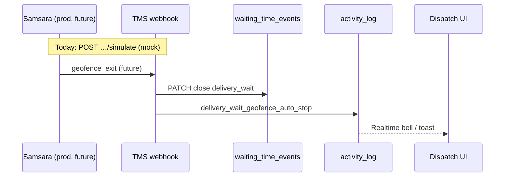

# Samsara geofence + wait time auto check-out (WT.23)

**Status:** **Mock stub in TMS dev** ✅ · **Real Samsara API** ⏳ pending credentials / prod backport.

**Client ask (Q2):** geofenced auto check-out at customer delivery + dispatch alert when driver leaves the site while wait timer is open.

**Repos:** mobile `proyecto_PP2_app_mobile` (this doc) · TMS dev `docs/TMS_DEV_REPOSITORY.md`.

---

## Current state

| Layer | Status |
|-------|--------|
| **Samsara in TMS prod** | Integrated (client); code not in dev repo yet |
| **Samsara in TMS dev (Netlify)** | **Stub only** — no outbound Samsara REST calls |
| **Mobile app** | No direct Samsara SDK; wait timer manual start/stop (WT.27) |
| **Wait time close on geofence** | **Implemented (mock)** in TMS dev |

---

## What WT.23 delivered (dev stub)

| Component | Path (TMS dev) |
|-----------|----------------|
| Close open `delivery_wait` | `lib/wait-time/close-open-delivery-wait.ts` |
| Geofence handler | `lib/integrations/samsara/handle-geofence-checkout.ts` |
| Mock simulate API | `POST /api/integrations/samsara/simulate` |
| Webhook placeholder | `POST /api/integrations/samsara/webhook` (disabled until env) |
| Config / status | `lib/integrations/samsara/config.ts` |
| Tests | `lib/integrations/samsara/__tests__/samsara-geofence.test.ts` |

**Pending Samsara integration:**

- Map real Samsara webhook payload → `GeofenceCheckoutInput`
- Outbound client (`SAMSARA_API_TOKEN`) for vehicles / geofences
- Backport prod TMS routes into dev repo
- Vehicle ↔ load ↔ driver correlation (today simulate uses `loadId` directly)

---

## Flow (target)



**Rules (aligned with client):**

| Rule | Value |
|------|--------|
| Trigger | Driver **exits customer delivery geofence** |
| Action | Close open `delivery_wait` (same as **End wait time**) |
| Start wait | Still **manual** on mobile (WT.27) — geofence does **not** start timer |
| Port / terminal | Not billed; geofence scope = **customer delivery** only |

---

## Mock simulate API (use today)

**Endpoint:** `POST {TMS_URL}/api/integrations/samsara/simulate`

**Auth:**

- TMS staff session (admin/dispatcher), **or**
- `SAMSARA_MOCK_ALLOW_SIMULATE=true` on TMS (dev Netlify only)

**Body example:**

```json
{
  "loadId": "<uuid>",
  "eventType": "geofence_exit",
  "geofenceName": "Customer delivery (mock)",
  "vehicleId": "mock-vehicle-1",
  "occurredAt": "2026-06-19T14:00:00.000Z"
}
```

**Success (closed):**

```json
{
  "ok": true,
  "integration": "mock_stub",
  "pendingSamsaraApi": true,
  "closed": true,
  "loadId": "...",
  "eventId": "..."
}
```

**Success (no open timer):**

```json
{
  "ok": true,
  "closed": false,
  "reason": "no_open_event"
}
```

---

## Webhook (when Samsara credentials ready)

**Endpoint:** `POST {TMS_URL}/api/integrations/samsara/webhook`

**Env (TMS server only — never Expo):**

| Variable | Purpose |
|----------|---------|
| `SAMSARA_ENABLED` | `true` to accept webhook |
| `SAMSARA_WEBHOOK_SECRET` | HMAC verify header `x-samsara-signature: sha256=…` |
| `SAMSARA_API_TOKEN` | Reserved — future outbound API |
| `SAMSARA_MOCK_ALLOW_SIMULATE` | `true` = simulate without staff role (dev) |

Until `SAMSARA_ENABLED=true`, webhook returns **503** with hint to use simulate.

**Status check:** `GET /api/integrations/samsara/webhook` → integration status JSON.

---

## Dispatch alert

On successful auto-close, TMS inserts `activity_log`:

- **action:** `delivery_wait_geofence_auto_stop`
- **details.type:** `samsara_geofence_checkout`
- **details.pending_samsara_api:** `true` (until live Samsara)

Feeds existing wait-time Realtime / bell patterns (WT.11–12).

---

## QA (mock, no Samsara account)

1. Mobile: **Arrived At Delivery** → **Start wait time** (open event).
2. TMS staff login → curl or REST client:

```bash
curl -X POST "$TMS_URL/api/integrations/samsara/simulate" \
  -H "Content-Type: application/json" \
  -H "Cookie: …" \
  -d '{"loadId":"LOAD_UUID","eventType":"geofence_exit","geofenceName":"Customer delivery (mock)"}'
```

3. Verify `waiting_time_events.end_time` set; TMS wait panel **Stopped**.
4. `activity_log` row with `delivery_wait_geofence_auto_stop`.
5. Mobile timer refreshes on focus → **Stopped** (no auto-start).

**TMS tests:**

```bash
npm test -- lib/integrations/samsara/__tests__/samsara-geofence.test.ts
```

---

## Related tasks

| Task | Relation |
|------|----------|
| WT.27 | Manual start; geofence only **stops** |
| WT.28 | e-POD auto-stop (parallel auto-stop path) |
| 8.4–8.16 | Mobile GPS live — future correlation with Samsara position |
| OFF.2 | Offline queue — geofence is server-side |

---

## Next steps when Samsara access granted

1. Audit **prod TMS** Samsara routes, env, webhook payload.
2. Backport into **tigerhawk-tms-main** dev repo.
3. Replace `parseGeofenceCheckoutBody` mapping with prod schema.
4. Enable `SAMSARA_ENABLED` + `SAMSARA_WEBHOOK_SECRET` on Netlify.
5. Register Samsara webhook URL → `{TMS_URL}/api/integrations/samsara/webhook`.
6. Remove or gate `SAMSARA_MOCK_ALLOW_SIMULATE` in production.

---

**Revision:** 19 Jun 2026 · WT.23 stub · pending live Samsara API.
