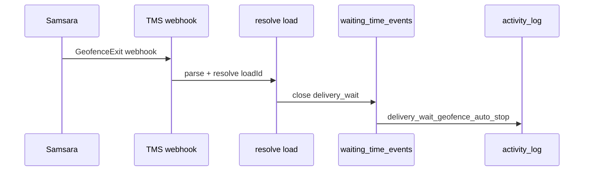

# Samsara geofence + wait time auto check-out (WT.23 / 9.5)

**Status:** **Live-ready in TMS dev** ✅ (27 Jun 2026) · enable with Netlify env + Samsara webhook registration.

**Client ask (Q2):** geofenced auto check-out at customer delivery + dispatch alert when driver leaves the site while wait timer is open.

**Repos:** mobile `proyecto_PP2_app_mobile` (this doc) · TMS dev `docs/TMS_DEV_REPOSITORY.md`.

---

## Current state

| Layer | Status |
|-------|--------|
| **TMS webhook + handler** | ✅ `POST /api/integrations/samsara/webhook` |
| **Samsara GeofenceExit parsing** | ✅ v2 beta payload + legacy mock fields |
| **Load resolution** | ✅ explicit `loadId` · `externalIds.loadId` · vehicle plate/VIN → driver → open `delivery_wait` |
| **REST ping** | ✅ `GET …/webhook?ping=1` (staff auth) tests `SAMSARA_API_TOKEN` |
| **Mobile app** | No direct Samsara SDK; wait timer manual start/stop (WT.27) |
| **Mock simulate** | ✅ still available for QA without fleet movement |

**Supabase:** SUPABASE no requiere cambios (uses existing `waiting_time_events`, `activity_log`).

---

## TMS components (tigerhawk-tms-main)

| Component | Path |
|-----------|------|
| Close open `delivery_wait` | `lib/wait-time/close-open-delivery-wait.ts` |
| Geofence handler | `lib/integrations/samsara/handle-geofence-checkout.ts` |
| Parse webhook / simulate | `lib/integrations/samsara/parse-geofence-event.ts` |
| Resolve load from vehicle | `lib/integrations/samsara/resolve-geofence-load.ts` |
| REST client ping | `lib/integrations/samsara/samsara-api-client.ts` |
| Config / modes | `lib/integrations/samsara/config.ts` |
| Mock simulate API | `POST /api/integrations/samsara/simulate` |
| Live webhook | `POST /api/integrations/samsara/webhook` |
| Status (+ optional ping) | `GET /api/integrations/samsara/webhook` · `?ping=1` |
| Tests | `lib/integrations/samsara/__tests__/samsara-geofence.test.ts` |

**Integration modes (`config.ts`):**

| Mode | When |
|------|------|
| `mock_stub` | `SAMSARA_ENABLED` not set — use simulate only |
| `webhook_only` | Webhook enabled, no API token |
| `live` | `SAMSARA_ENABLED=true` **and** `SAMSARA_API_TOKEN` set |

---

## Flow

**Rules:**

| Rule | Value |
|------|--------|
| Trigger | Driver **exits customer delivery geofence** |
| Action | Close open `delivery_wait` (same as **End wait time**) |
| Start wait | Still **manual** on mobile (WT.27) |
| Port / terminal | Not billed; customer delivery geofence only |

---

## Env (TMS server — never Expo)

| Variable | Purpose |
|----------|---------|
| `SAMSARA_ENABLED` | `true` to accept POST webhook |
| `SAMSARA_API_TOKEN` | Samsara REST Bearer — required for **`live`** mode |
| `SAMSARA_WEBHOOK_SECRET` | HMAC verify `x-samsara-signature: sha256=…` |
| `SAMSARA_MOCK_ALLOW_SIMULATE` | Dev only — simulate without staff session |

Until `SAMSARA_ENABLED=true`, webhook returns **503** (use simulate for QA).

---

## Live webhook payload (Samsara GeofenceExit v2)

Register in Samsara dashboard:

`POST {TMS_URL}/api/integrations/samsara/webhook`

Minimal fields used by TMS:

- `eventType`: `GeofenceExit`
- `data.address.name` — geofence label in audit note
- `data.address.externalIds.loadId` — **recommended** (UUID Tigerhawk load)
- `data.vehicle.id`, `licensePlate`, `vin`, `name` — fallback load resolution

If `loadId` is omitted, TMS matches **open delivery_wait** for driver whose `truck_number` aligns with vehicle plate/name, or truck VIN/plate in `trucks` table.

---

## Mock simulate API (QA without Samsara)

**Endpoint:** `POST {TMS_URL}/api/integrations/samsara/simulate`

See `docs/QA_SAMSARA_GEOFENCE_MOCK.md`.

---

## Enable live (checklist)

1. Set Netlify env: `SAMSARA_ENABLED=true`, `SAMSARA_API_TOKEN`, `SAMSARA_WEBHOOK_SECRET`.
2. Redeploy TMS.
3. `GET {TMS_URL}/api/integrations/samsara/webhook?ping=1` (staff session) → `mode: live`, `apiPing.ok: true`.
4. Register Samsara webhook → GeofenceExit → TMS URL above.
5. Configure customer delivery geofences in Samsara; set `externalIds.loadId` on address or vehicle when possible.
6. QA: mobile Check In → drive/simulate geofence exit → wait closes + `activity_log`.

---

## Related tasks

| Task | Relation |
|------|----------|
| WT.27 | Manual start; geofence only **stops** |
| WT.28 | e-POD auto-stop (parallel path) |
| 8.4–8.16 | Mobile GPS via Supabase — **≠** Samsara map |
| 9.4 | Offline queue — geofence is server-side |

---

**Revision:** 27 Jun 2026 · **9.5** live-ready · mobile doc mirror of TMS dev implementation.
